 

---

---

## 🚀 Core Features

<table>
<tr>
<td>

<!-- Left side: feature table -->

<table>
  <tr>
    <td>🧠 <strong>Community System</strong></td>
    <td>Discord-style communities with roles, chats, pinboards</td>
  </tr>
  <tr>
    <td>🏆 <strong>Tournament Engine</strong></td>
    <td>Real-time brackets, solo/team joins, auto progress logic</td>
  </tr>
  <tr>
    <td>👥 <strong>Team System</strong></td>
    <td>Create teams, avatars, invites, stats</td>
  </tr>
  <tr>
    <td>💬 <strong>Socket Chat</strong></td>
    <td>Team/tournament chats with seen/typing indicators</td>
  </tr>
  <tr>
    <td>📸 <strong>Post Feed</strong></td>
    <td>Upload images/videos, like & comment like a gaming social feed</td>
  </tr>
  <tr>
    <td>🔔 <strong>Live Notifications</strong></td>
    <td>Invite alerts, match status, chat replies, all synced</td>
  </tr>
  <tr>
    <td>💸 <strong>Wallet System</strong></td>
    <td>Recharge, track, and soon — payout to winners</td>
  </tr>
</table>

</td>

<td align="center" width="30%">

<!-- Right side: animated GIF -->

</td>
</tr>
</table>

---

## 🛠️ Tech Stack

---

## 🔮 Roadmap

```mermaid
graph TD
  A[🧱 MVP Completed] --> B[🏅 Player & Team XP System]
  A --> C[📱 Push Notification Panel]
  A --> D[💸 Wallet Payout + Fee Logic]
  A --> E[🔍 Explore & Search Engine]
  B --> F[🚀 Launch Ready]
```

